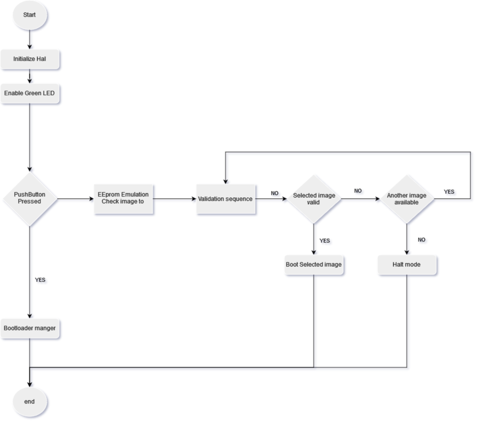

# STM32f4 Custom bootloader V2.0

Custom UART bootloader for STM32F4291-Discovery board.

# Table of contents

- [Introduction](#introduction)
- [Bootloader features](#bootloader-features)
- [Version2.0 features](#Version2.0-features)
- [Design](#design)
  - [Memory design](#memory-design)
    - [Software design](#software-design)
    - [Bootloader manger](#bootloader-manger)
    - [Validation and Verification](#Validation-and-Verification)
    - [Bootloader mode](#bootloader-mode)
- [Tool used](#tool-used)
- [How to use it](#how-to-use-it)
  - [Bootloader build](#bootloader-build)
  - [Image build](#image-build)
- [Upcoming features](#upcoming-features)
- [References](#references)

# Introduction

Bootloader is a piece of code that runes right after powering up the MCU and responsible for handling the starting sequence of MCU, upgrade images and select which image should be booted up without needing for any external hardware.

It responsible for switch the MCU back and forth between booting mode for any software update and application.

Current custom bootloader targeting STM32F4291-discovery board.

# Bootloader features

- Support UART communication protocol in uploading images
- Flash, erase, Read, Jump for an image
- Flash python script
- Automatic selection of either mode using input signal

# Version2.0 features

- Suppot more than one image with full control on them
- dedicate a section for eeprom emulation used by bootloader to select the image to boot
- image header for each image carry diffrent information for validation and verification
- using CRC32 library to validate the integrity of the image

# Design

## Memory design

 <br>
_Figure 1. Memory map for Stm32f4._

```
	---------------------------------------
	|		|           		| 0x0800 0000H
	|    	|     Bootloader  	|   |
	|   Sector 0:2 	|      	|   |
	|		|     Bank 1  	|   V
	|		|     48 K            	| 0x0800 BFFFH
	---------------------------------------
	|		|           		| 0x0801 0000H
	|    	|     Image 1   	|   |
	|   Sector 4:5 	|      	|   |
	|		|     Bank 1  	|   V
	|		|     192  K            | 0x0803 FFFFH
	---------------------------------------
	|		|           		| 0x0804 0000H
	|    	|     Image 2  	|   |
	|   Sector 6:7 	|      	|   |
	|		|     Bank 1  	|   V
	|		|     256 K            	| 0x0807 FFFFH
	---------------------------------------
	|		|           		| 0x0810 B000H
	|    	|     Eeprom emulation  	|   |
	|   Sector 14 	|      	|   |
	|		|     Bank 2 	|   V
	|		|     16 K            	| 0x0810 3FFFH
	---------------------------------------
	|		|           		| 0x081E 0000H
	|    	|     Image 3  	|   |
	|   Sector 23 	|      	|   |
	|		|     Bank 2 	|   V
	|		|     128 K            	| 0x081F FFFFH
	---------------------------------------
```

## Software design

### Bootloader manger

Software starts with initializing hardware (Systick Timer, GPIO, Interrupts, Usart and DMA) then light the green red to tell the user to push the hardware button for 5 Seconds if he wants to enter bootloader mode , if user choose bootloader the green led is turned off and start the custom bootloader , if user didnot push hardware button software starts to check the eeprom emulation section which image is set to activated and ready to boot between 3 images , after choosing one of them start to verification process.

finally if there were no image to boot we inform the user and enter in halt mood waiting for any booting sequence.

 <br>
_Figure 2. Bootloader manger flowchart._

### Validation and Verification

verification process start by reading the image header file which contain information needed for booting and validation such as (CRC value , Vector table add ,stack pointer value) then we calculate the CRC for the selected image and compare it with the passed value , validate the stack pointer and version id if those were okay we start the booting sequence if not reselect the image to another one.

finally if its failed to verify for any image return failed to the bootloader manger.

 <br>
_Figure 3. Validation and Verification flowchart._

### Bootloader mode

Firstly it receive data trough UART which indicate the process nedded to be done with its details then start to select one of the bootloader function then check if there is an error in any step then clear buffers and flags to be ready for next command.

finally in the end of flashing update the eeprom emulation section with the new active image to read in the next reset.

 <br>
_Figure 4. Bootloader mode flowchart._

# Tool used

- True studio V 9.3.0 or Stm32Cubeide V1.7
- Putty / Teraterm for establish communication through Usart
- Python Script to flash the image
  -For CRC32 calculations I used this <a href="https://pycrc.org/index.html">PyCRC's</a> generated C library.

# How to use it

## Bootloader build

- Build main bootloader using any tool chain or using True studio or Stm32cubeide
- Flash hex file of bootloader using any Stm32flasher

## Image build

- Create your image
- Replace and rename your linker script file with the proper script in app folder
- Build your image
- Open putty or terraterm in order to make full use of bootloader features with Configration
  - Baud rate: 115200
  - Data bits: 8
  - Parity: none
  - Stop bits: 1
- Or use flasher script in order to flash your image

  `Python flasher.py Com10 My_image.hex`
   <br>
  _Figure 5. flasher script result._

# Upcoming features

- Making a full automatic time/uart based bootloader without using pushbutton
- ~~Capability of adding 3 diffrent images with control on which to operate~~(Done in version 2)
- Capability of updating bootloader
- ~~Using image header in order to add information to the image~~ (Done in version 2)
- ~~Adding CRC check stage to increase security~~ (Done in version 2)
- Use write protection for the bootloader itself
- ~~Use EEPROM emulation to select between the deiffrent image~~(Done in version 2)
- Capability to accept new flashing order while inside App
- Using Can Communication protocol

# References

## English

- <a href="https://www.beningo.com/insights/white-papers/bootloader-design-for-microcontrollers-in-embedded-systems/">Bootloader Design for Microcontrollers in Embedded Systems</a> White paper

## Arabic

- <a href="https://www.youtube.com/playlist?list=PLl3yF2kjT6AzLxhOuCEBY-8RzOIB1sfnN">Embedded Boot-Loader Design Course</a> YouTube playlist
- <a href="https://www.youtube.com/playlist?list=PLPFp2zIiTnxV5e75pGKIccaR0BjmpIS79">Flash Memory and Bootloaders</a> YouTube playlist
