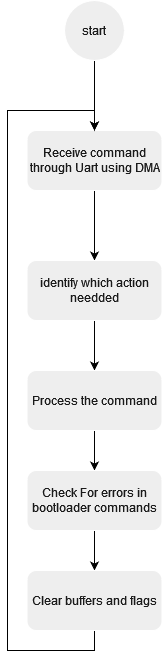

# STM32f4 Custom bootloader
Custom UART bootloader for STM32F4291-Discovery board.

# Table of contents
- [Introduction](#introduction)
- [Bootloader features](#bootloader-features)
- [Design](#design)
	- [Memory design](#memory-design)
  	- [Software design](#software-design)
		- [Bootloader manger](#bootloader-manger)
		- [Bootloader mode](#bootloader-mode)
- [Tool used](#tool-used)
- [How to use it](#how-to-use-it)
	- [Bootloader build](#bootloader-build)
	- [Image build](#image-build)
- [Upcoming features](#upcoming-features)
- [References](#references)


# Introduction
Bootloader is a piece of code that runes right after powering up the MCU and responsible for handling the starting sequence of MCU, upgrade images and select which image should be booted up without needing for any external hardware.

It responsible for switch the MCU back and forth between booting mode for any software update and application.

Current custom bootloader targeting STM32F4291-discovery board.

# Bootloader features
- Support UART communication protocol in uploading images
- Flash, erase, Read, Jump for an image 
- Flash python script 
- Automatic selection of either mode using input signal

# Design 
## Memory design 
 <br>
	*Figure 1. Memory map for Stm32f4.*
`````````````
	---------------------------------------
	|		|           		  | 0x0800 0000H
	|		|            		|   |
	|    Bank 1		|     Bootloader  	|   |
	|		|     Sector1:Sector4  	|   V
	|		|     128 K            	| 0x0801 FFFFH
	---------------------------------------
	|		|  			  | 0x080E 0000H
	|		|      Image 1        |   |
	|    		|      Main image	|   |
	|		|      Sector 11       	|   V
	|		|      128 K          	| 0x080F FFFFH
	|    Bank 2		------------------------
	|		|               	| 0x081E 0000H
	|		|      Image 2        	|   |
	|    		|      Secondary image	|   |
	|		|      Sector 23       	|   V
	|		|      128 K          	| 0x081F FFFFH
	---------------------------------------
````````````
##  Software design
### Bootloader manger
Software starts with initializing hardware (Systick Timer, GPIO, Interrupts, Usart and DMA) then light the green red to tell the user to push the hardware button for 5 Seconds if he wants to enter bootloader mode , if user choose bootloader the green led is turned off and start the custom bootloader , if user didn’t push hardware button software starts to check wither Main image is available if true start to process booting sequence else check if the secondary image is available if true start booting sequence  for the secondary image , Finally if both images are in available then red led  will light up which is indecation for halt mode .
		
 <br>
*Figure 2. Bootloader manger flowchart.*
			
			
### Bootloader mode 
Firstly it receive data trough UART which indicate the process nedded to be done with its details then start to select one of the bootloader function then check if there is an error in any step then clear buffers and flags to be ready for next command.
		
 <br>
*Figure 3. Bootloader mode flowchart.*

# Tool used
- True studio V 9.3.0 or Stm32Cubeide V1.7 
- Putty / Teraterm for establish communication through Usart
- Python Script to flash the image

# How to use it
## Bootloader build
- Build main bootloader using any tool chain or using True studio or Stm32cubeide
- Flash hex file of bootloader using any Stm32 flashers
	
## Image build
- Create your image
- Replace and rename your linker script file with the proper script in app folder
- Build your image
- Open putty or terraterm in order to make full use of bootloader features with Configration 
	- Baud rate: 115200
	- Data bits: 8
	- Parity: none
	- Stop bits: 1
- Or use flasher script in order to flash your image
	```
	Python flasher.py Com My_image.hex  
	```
	 <br>
*Figure 4. flasher script result.*
# Upcoming features

- Making a full automatic time/uart based bootloader without using pushbutton
- Capability of updating bootloader 
- Using image header in order to add information to the image
- Adding CRC check stage to increase security 
- Use write protection for the bootloader itself 
- Capability to accept new flashing order while inside App  
- Using Can Communication protocol 


# References
## English
- <a href="https://www.beningo.com/insights/white-papers/bootloader-design-for-microcontrollers-in-embedded-systems/">Bootloader Design for Microcontrollers in Embedded Systems</a> White paper
## Arabic
- <a href="https://www.youtube.com/playlist?list=PLl3yF2kjT6AzLxhOuCEBY-8RzOIB1sfnN">Embedded Boot-Loader Design Course</a> YouTube playlist
- <a href="https://www.youtube.com/playlist?list=PLPFp2zIiTnxV5e75pGKIccaR0BjmpIS79">Flash Memory and Bootloaders</a> YouTube playlist
